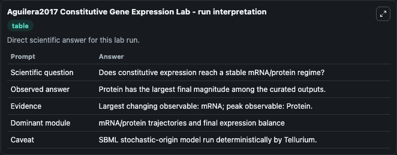
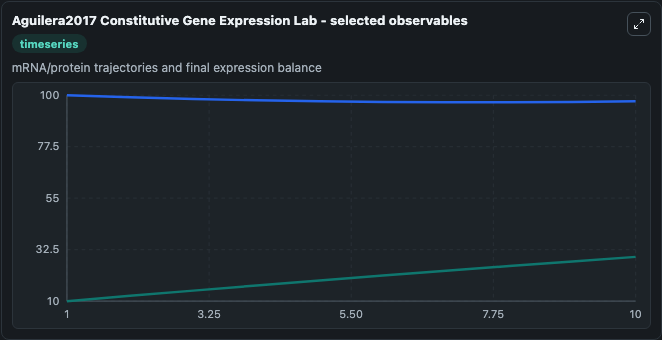
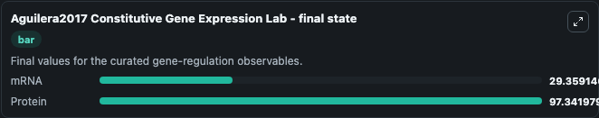

# Aguilera2017 Constitutive Gene Expression

constitutive mRNA/protein expression.

Scientific question: Does constitutive expression reach a stable mRNA/protein regime?

The bundled SBML file in `models/core/data` is the scientific source of truth. The Python wrapper only declares Biosimulant ports and Tellurium metadata.

<!-- BIOSIMULANT_VISUALS_START -->
### Output Visualizations

<!-- BIOSIMULANT_VISUALS_END -->
