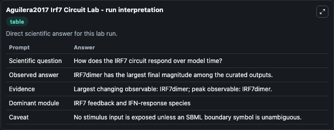
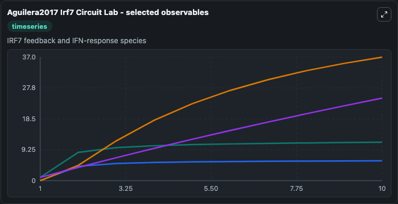
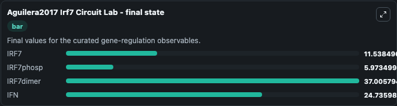

# Aguilera2017 Irf7 Circuit

murine IRF7/IFN gene circuit.

Scientific question: How does the IRF7 circuit respond over model time?

The bundled SBML file in `models/core/data` is the scientific source of truth. The Python wrapper only declares Biosimulant ports and Tellurium metadata.

<!-- BIOSIMULANT_VISUALS_START -->
### Output Visualizations

<!-- BIOSIMULANT_VISUALS_END -->
