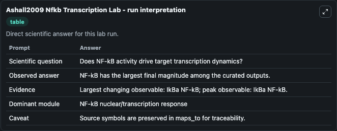
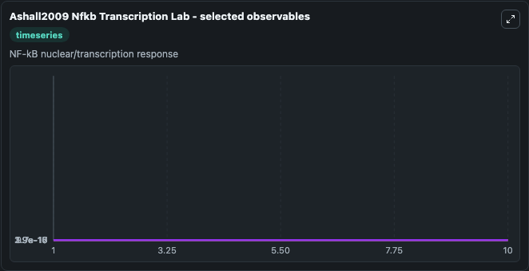
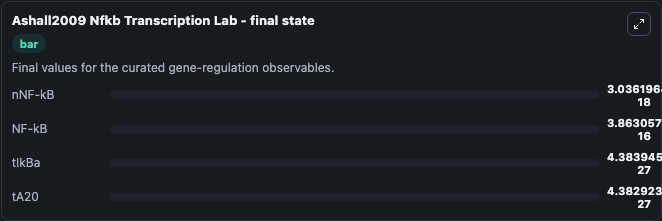

# Ashall2009 Nfkb Transcription

NF-kB dependent transcription.

Scientific question: Does NF-kB activity drive target transcription dynamics?

The bundled SBML file in `models/core/data` is the scientific source of truth. The Python wrapper only declares Biosimulant ports and Tellurium metadata.

<!-- BIOSIMULANT_VISUALS_START -->
### Output Visualizations

<!-- BIOSIMULANT_VISUALS_END -->
