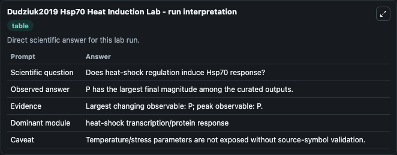
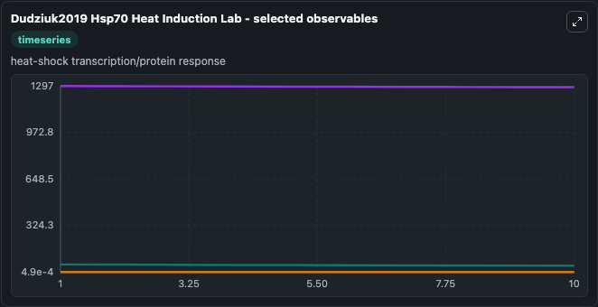
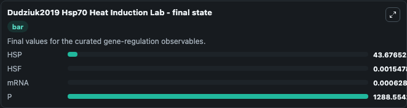

# Dudziuk2019 Hsp70 Heat Induction

Hsp70 heat-shock induction.

Scientific question: Does heat-shock regulation induce Hsp70 response?

The bundled SBML file in `models/core/data` is the scientific source of truth. The Python wrapper only declares Biosimulant ports and Tellurium metadata.

<!-- BIOSIMULANT_VISUALS_START -->
### Output Visualizations

<!-- BIOSIMULANT_VISUALS_END -->
