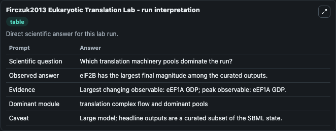
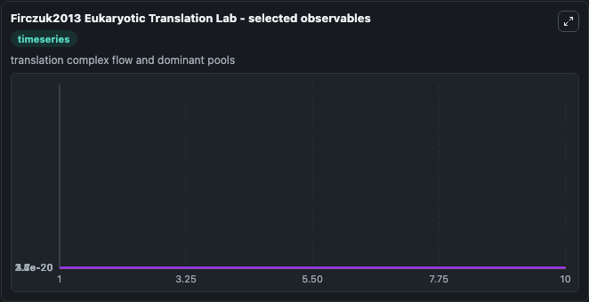
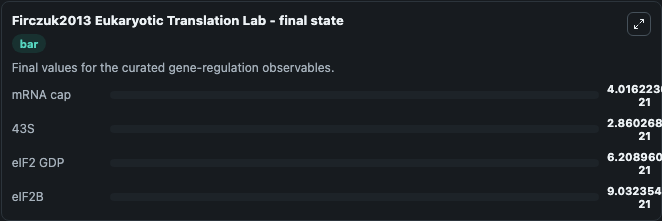

# Firczuk2013 Eukaryotic Translation

yeast mRNA translation machinery.

Scientific question: Which translation machinery pools dominate the run?

The bundled SBML file in `models/core/data` is the scientific source of truth. The Python wrapper only declares Biosimulant ports and Tellurium metadata.

<!-- BIOSIMULANT_VISUALS_START -->
### Output Visualizations

<!-- BIOSIMULANT_VISUALS_END -->
