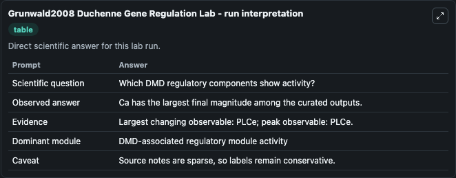
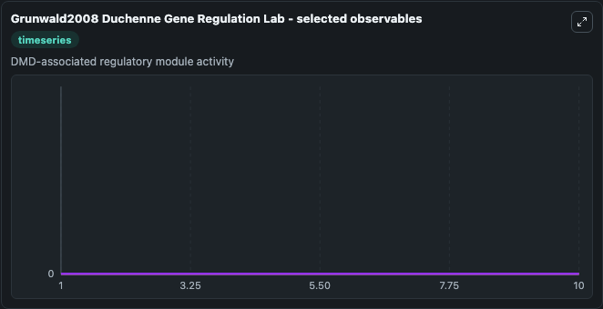
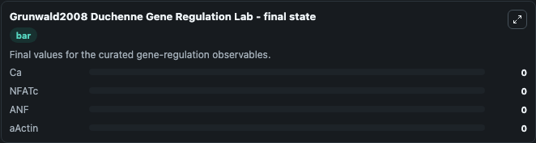

# Grunwald2008 Duchenne Gene Regulation

Duchenne muscular dystrophy gene-regulatory network.

Scientific question: Which DMD regulatory components show activity?

The bundled SBML file in `models/core/data` is the scientific source of truth. The Python wrapper only declares Biosimulant ports and Tellurium metadata.

<!-- BIOSIMULANT_VISUALS_START -->
### Output Visualizations

<!-- BIOSIMULANT_VISUALS_END -->
