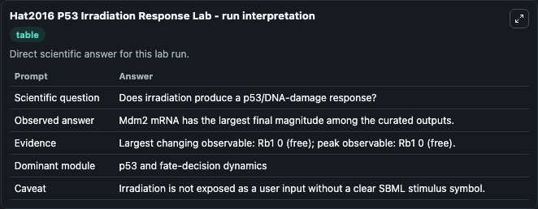
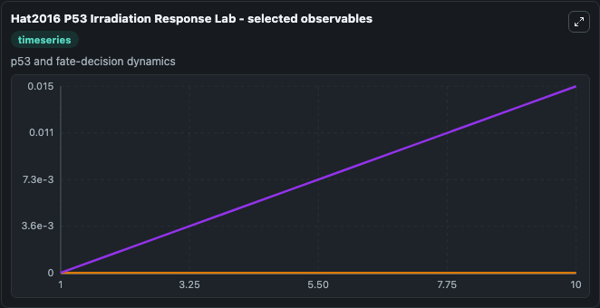
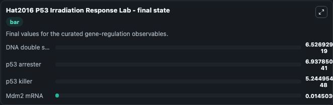

# Hat2016 P53 Irradiation Response

p53 irradiation/cell-fate response.

Scientific question: Does irradiation produce a p53/DNA-damage response?

The bundled SBML file in `models/core/data` is the scientific source of truth. The Python wrapper only declares Biosimulant ports and Tellurium metadata.

<!-- BIOSIMULANT_VISUALS_START -->
### Output Visualizations

<!-- BIOSIMULANT_VISUALS_END -->
