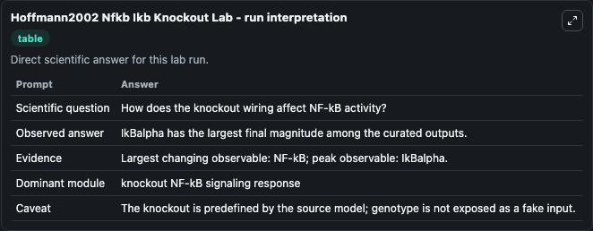
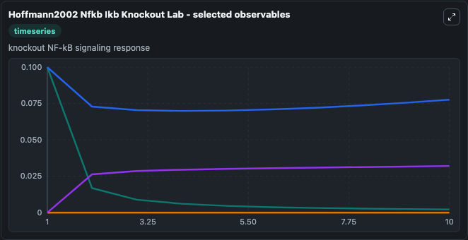
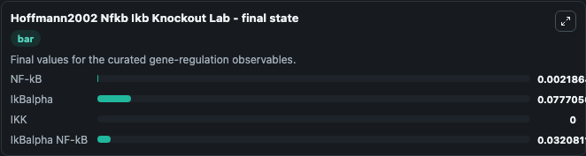

# Hoffmann2002 Nfkb Ikb Knockout

NF-kB/IkB knockout signaling.

Scientific question: How does the knockout wiring affect NF-kB activity?

The bundled SBML file in `models/core/data` is the scientific source of truth. The Python wrapper only declares Biosimulant ports and Tellurium metadata.

<!-- BIOSIMULANT_VISUALS_START -->
### Output Visualizations

<!-- BIOSIMULANT_VISUALS_END -->
