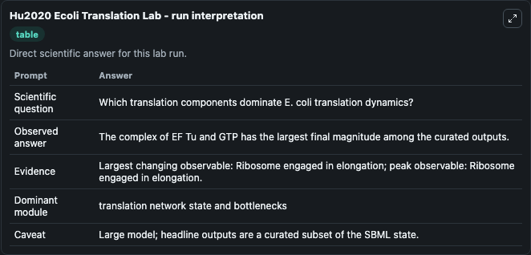
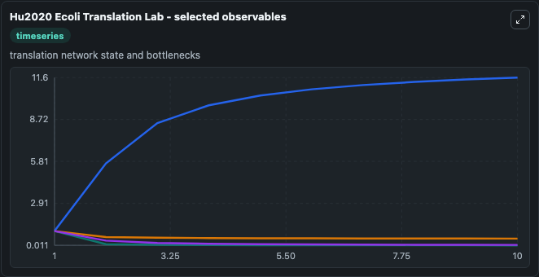
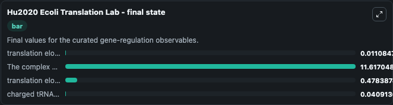

# Hu2020 Ecoli Translation

E. coli translation model.

Scientific question: Which translation components dominate E. coli translation dynamics?

The bundled SBML file in `models/core/data` is the scientific source of truth. The Python wrapper only declares Biosimulant ports and Tellurium metadata.

<!-- BIOSIMULANT_VISUALS_START -->
### Output Visualizations

<!-- BIOSIMULANT_VISUALS_END -->
