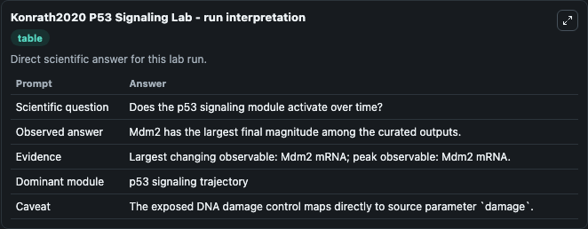
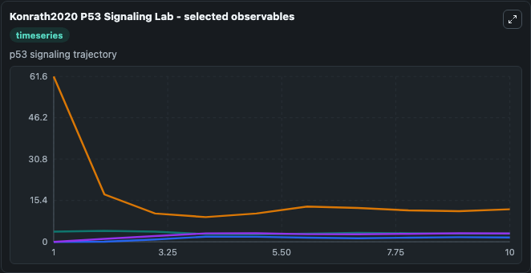
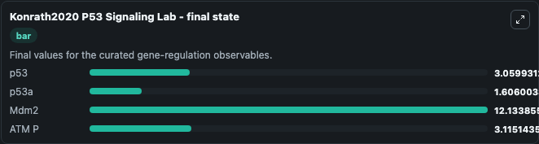

# Konrath2020 P53 Signaling

p53 subpopulation signaling.

Scientific question: Does the p53 signaling module activate over time?

The bundled SBML file in `models/core/data` is the scientific source of truth. The Python wrapper only declares Biosimulant ports and Tellurium metadata.

<!-- BIOSIMULANT_VISUALS_START -->
### Output Visualizations

<!-- BIOSIMULANT_VISUALS_END -->
