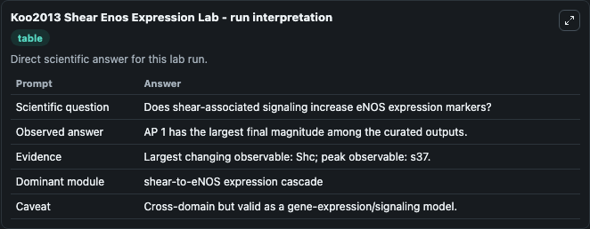
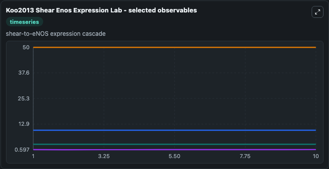
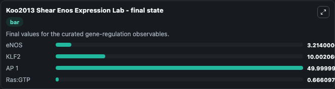

# Koo2013 Shear Enos Expression

shear-stress induced eNOS expression.

Scientific question: Does shear-associated signaling increase eNOS expression markers?

The bundled SBML file in `models/core/data` is the scientific source of truth. The Python wrapper only declares Biosimulant ports and Tellurium metadata.

<!-- BIOSIMULANT_VISUALS_START -->
### Output Visualizations

<!-- BIOSIMULANT_VISUALS_END -->
