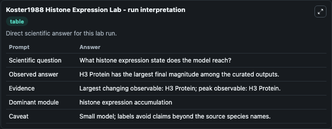
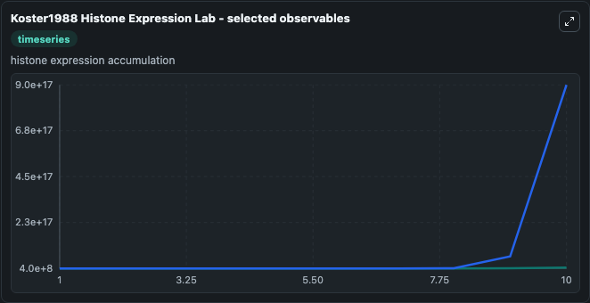
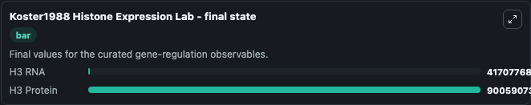

# Koster1988 Histone Expression

Xenopus histone expression kinetics.

Scientific question: What histone expression state does the model reach?

The bundled SBML file in `models/core/data` is the scientific source of truth. The Python wrapper only declares Biosimulant ports and Tellurium metadata.

<!-- BIOSIMULANT_VISUALS_START -->
### Output Visualizations

<!-- BIOSIMULANT_VISUALS_END -->
