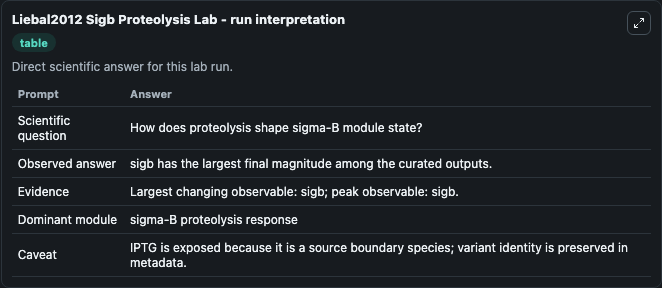
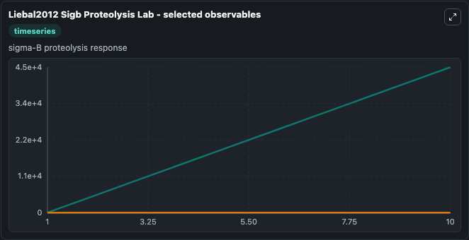
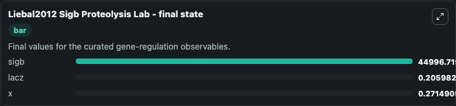

# Liebal2012 Sigb Proteolysis

B. subtilis sigma-B proteolysis.

Scientific question: How does proteolysis shape sigma-B module state?

The bundled SBML file in `models/core/data` is the scientific source of truth. The Python wrapper only declares Biosimulant ports and Tellurium metadata.

<!-- BIOSIMULANT_VISUALS_START -->
### Output Visualizations

<!-- BIOSIMULANT_VISUALS_END -->
