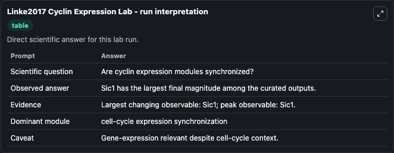
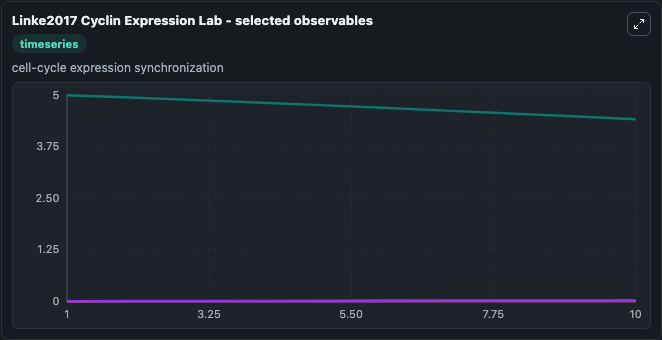
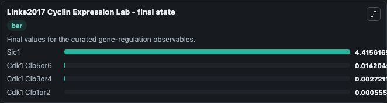

# Linke2017 Cyclin Expression

yeast cyclin B2/B3 expression.

Scientific question: Are cyclin expression modules synchronized?

The bundled SBML file in `models/core/data` is the scientific source of truth. The Python wrapper only declares Biosimulant ports and Tellurium metadata.

<!-- BIOSIMULANT_VISUALS_START -->
### Output Visualizations

<!-- BIOSIMULANT_VISUALS_END -->
