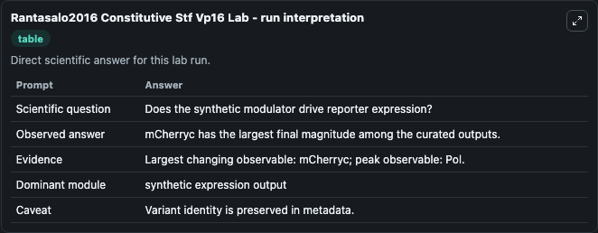
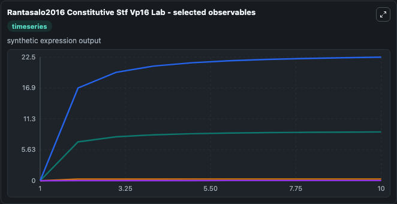
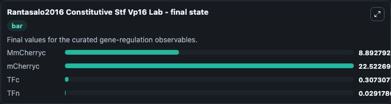

# Rantasalo2016 Constitutive Stf Vp16

constitutive synthetic expression modulator.

Scientific question: Does the synthetic modulator drive reporter expression?

The bundled SBML file in `models/core/data` is the scientific source of truth. The Python wrapper only declares Biosimulant ports and Tellurium metadata.

<!-- BIOSIMULANT_VISUALS_START -->
### Output Visualizations

<!-- BIOSIMULANT_VISUALS_END -->
